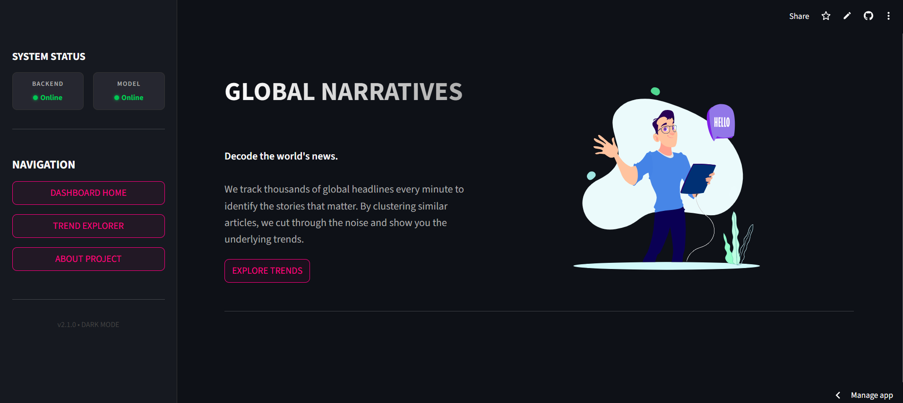
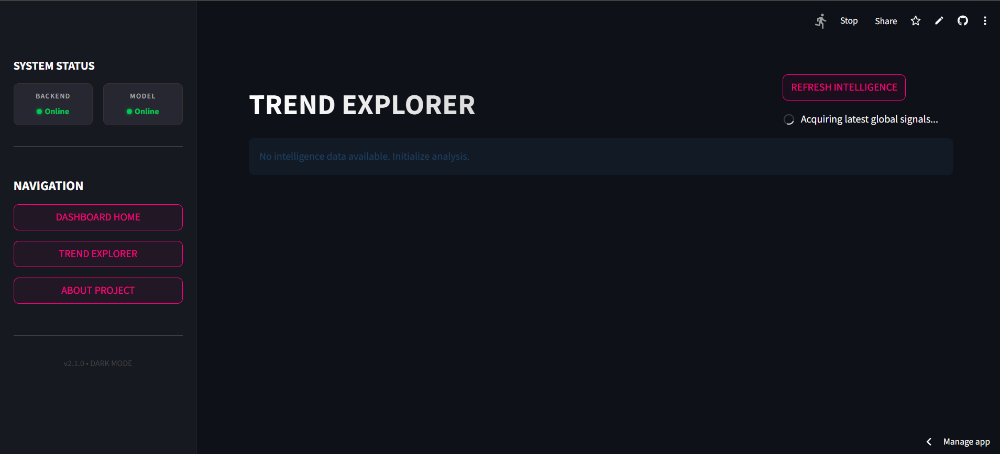
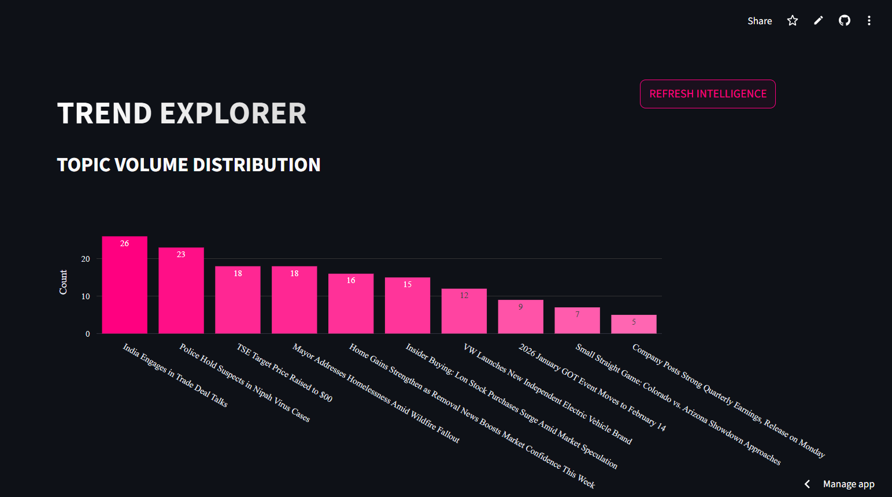
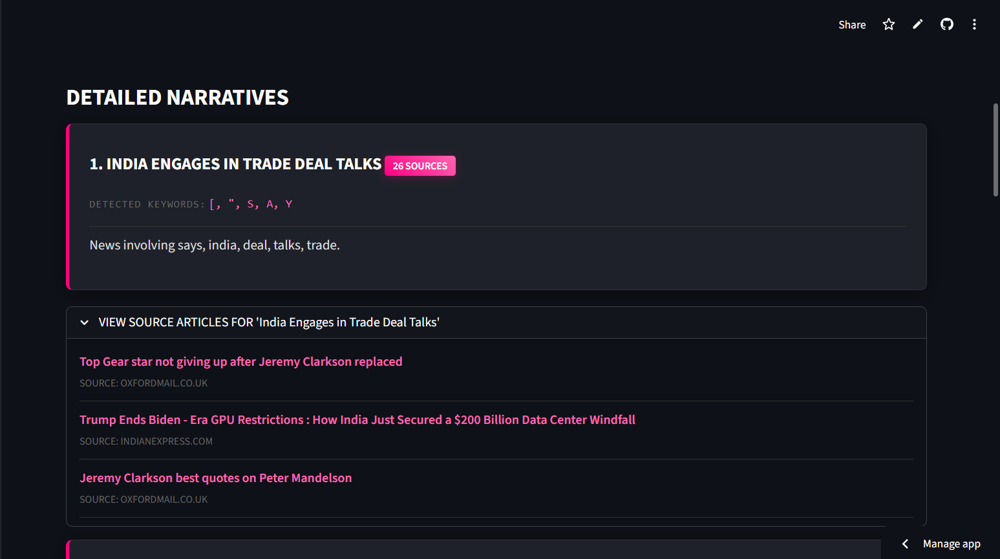

# News Trend NLP

A full-stack news intelligence system that automatically fetches, clusters, and analyzes global news articles in real-time. The system uses Natural Language Processing to identify underlying themes across thousands of headlines and groups related stories into coherent trends.

**Live Demo:** [news-trend-nlp.streamlit.app](https://news-trend-nlp.streamlit.app/)

---

## Screenshots

### Home Page


### News Feed


### Trend Analysis Chart


### Trend Details


---

## How It Works

The system operates through a three-stage pipeline:

1. **Data Acquisition**: The backend fetches the latest English news article metadata from the GDELT Project API (Global Database of Events, Language, and Tone).

2. **Topic Clustering**: Article titles are sent to a dedicated model service that applies TF-IDF vectorization followed by Non-Negative Matrix Factorization (NMF) to group similar articles into topics. Each topic is assigned a set of representative keywords.

3. **Headline Generation**: For each detected topic, the Hugging Face Inference API (using Qwen2.5-72B-Instruct) generates a concise, human-readable headline based on the extracted keywords.

---

## System Architecture

The project follows a microservices architecture with three independent components:

| Component | Technology | Role |
|-----------|------------|------|
| Backend API | Django REST Framework | Orchestrates the pipeline, manages database, serves REST API endpoints |
| Model Service | FastAPI | Performs TF-IDF vectorization and NMF topic modeling |
| Frontend | Streamlit | Interactive dashboard for visualizing trends and metrics |

### External Services

- **GDELT Project API v2**: Source of real-time news metadata (titles, URLs, sources)
- **Hugging Face Inference API**: LLM-based headline generation

---

## Deployment

The system is deployed across three platforms:

| Service | Platform | URL |
|---------|----------|-----|
| Frontend | Streamlit Cloud | [news-trend-nlp.streamlit.app](https://news-trend-nlp.streamlit.app/) |
| Backend API | Render | [news-trend-backend.onrender.com](https://news-trend-backend.onrender.com) |
| Model Service | Render | [news-trend-model.onrender.com](https://news-trend-model.onrender.com) |

Note: Free-tier Render instances may spin down after periods of inactivity. The frontend includes an automatic wake-up mechanism that detects sleeping services and sends ping requests.

---

## Project Structure

```
news-trend-nlp/
├── backend_django/
│   ├── config/              # Django project settings and URL routing
│   └── trends/              # Main application
│       ├── models.py        # RunLog and TrendTopic database models
│       ├── views.py         # REST API views
│       └── utils.py         # GDELT fetching, model service calls, LLM integration
├── model_service/
│   ├── main.py              # FastAPI application entry point
│   └── topic_model.py       # TF-IDF + NMF clustering implementation
├── frontend_streamlit/
│   ├── app.py               # Streamlit dashboard application
│   └── style.css            # Custom dark theme styling
└── img/                     # UI screenshots
```

---

## Technical Stack

**Language:** Python 3.9+

**Backend:**
- Django 5.0
- Django REST Framework
- PostgreSQL (production) / SQLite (development)
- Hugging Face Hub (LLM integration)

**Model Service:**
- FastAPI
- Uvicorn
- Scikit-learn (TfidfVectorizer, NMF)
- NumPy

**Frontend:**
- Streamlit
- Plotly (charts)
- Pandas (data handling)
- Streamlit-Lottie (animations)

---

## API Reference

### Backend API

**GET /api/latest/**

Returns the results of the most recent successful analysis run.

Response:
```json
{
  "run_id": 1,
  "timestamp": "2026-02-07T12:00:00Z",
  "trends": [
    {
      "label": "Global Market Rally Continues",
      "keywords": ["market", "stocks", "economy", "trading", "growth"],
      "summary": "News involving market, stocks, economy, trading, growth.",
      "article_count": 15,
      "representative_articles": [...]
    }
  ]
}
```

**POST /api/run/**

Triggers a new analysis pipeline. Fetches fresh data from GDELT, runs clustering, generates headlines, and saves results to database.

### Model Service API

**POST /predict_topics**

Accepts a list of article titles and returns topic clusters.

Request:
```json
{
  "articles": [
    {"id": "0", "text": "Stock markets surge amid positive economic data"},
    {"id": "1", "text": "Tech giants report record quarterly earnings"}
  ],
  "num_topics": 10
}
```

Response:
```json
{
  "topics": [
    {
      "topic_id": 0,
      "keywords": ["market", "stocks", "surge", "economic", "data"],
      "article_ids": ["0"]
    }
  ]
}
```

---

## Local Development Setup

### Prerequisites
- Python 3.9 or higher
- Git

### 1. Clone the Repository
```bash
git clone https://github.com/YOUR_USERNAME/news-trend-nlp.git
cd news-trend-nlp
```

### 2. Create Virtual Environment and Install Dependencies
```bash
python -m venv .venv
.venv\Scripts\activate
pip install -r requirements.txt
```

### 3. Configure Environment Variables

Create a `.env` file in the project root with:
```env
SECRET_KEY=your_django_secret_key
DEBUG=True
MODEL_SERVICE_URL=http://localhost:8001
HUGGINGFACEHUB_API_TOKEN=your_huggingface_token
DJANGO_API_URL=http://localhost:8000/api/latest/
TRIGGER_RUN_URL=http://localhost:8000/api/run/
```

### 4. Run Database Migrations
```bash
cd backend_django
python manage.py migrate
cd ..
```

### 5. Start All Services

On Windows, run the included batch script to start all three services simultaneously:
```bash
run_dev.bat
```

This script launches:
- Model Service (FastAPI) at `http://localhost:8001`
- Backend API (Django) at `http://localhost:8000`
- Frontend (Streamlit) at `http://localhost:8501`

---

## Usage

1. Open the Streamlit dashboard in your browser.
2. Click **EXPLORE TRENDS** on the home page or navigate to **TREND EXPLORER** from the sidebar.
3. Click **REFRESH INTELLIGENCE** to trigger a new analysis cycle.
4. View the detected trends, their associated keywords, article counts, and source articles.

---

## Machine Learning Details

### TF-IDF Vectorization
- Maximum 2000 features
- English stopwords removed
- Terms appearing in fewer than 2 documents are ignored
- Terms appearing in more than 95% of documents are ignored

### NMF (Non-Negative Matrix Factorization)
- Default: 10 topics per analysis run
- Initialization: NNDSVD (faster convergence, better sparsity)
- Maximum 200 iterations
- Each document is assigned to its dominant topic based on the highest weight in the document-topic matrix

---

## License

This project is available for educational and research purposes.
