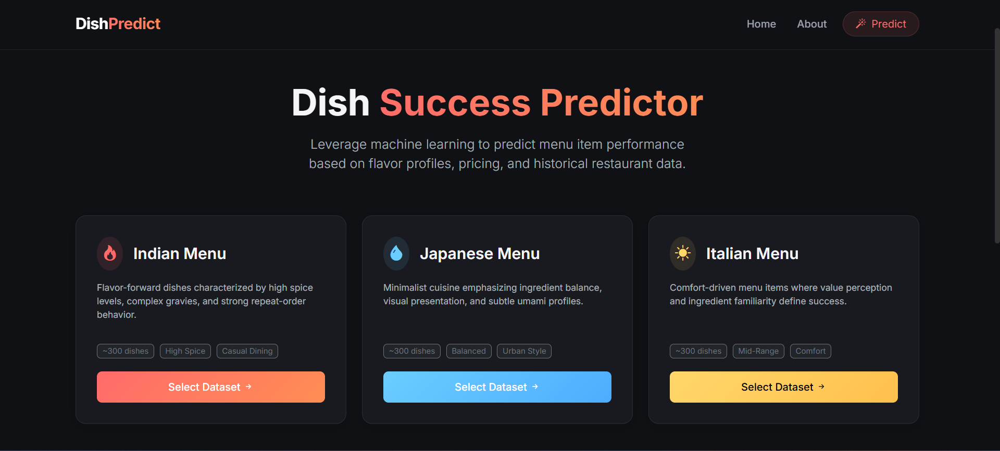
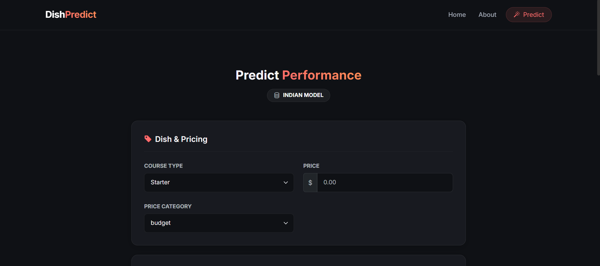
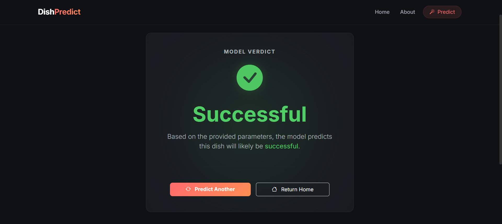
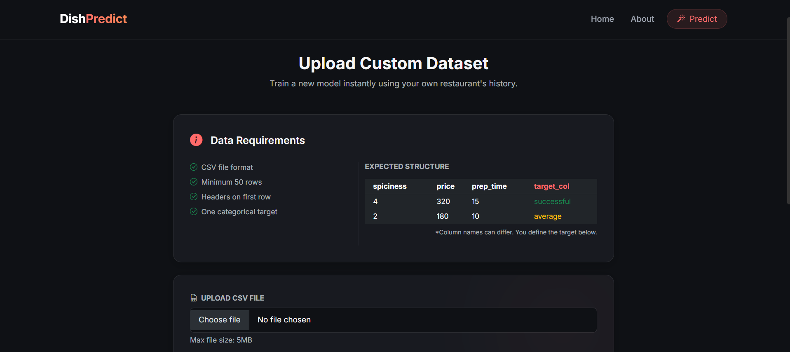

# 🍽️ Dish Success Prediction – Machine Learning Web App

[](https://resto-dishes-prediction.onrender.com)

Predict whether a new restaurant dish will be **successful**, **average**, or **unsuccessful** *before* adding it to the menu.

This project is a **full end-to-end machine learning system** — from data generation and model training to a deployed web application with real-time predictions.

---

## 🚀 Features

- 📊 **Dish Performance Prediction** (3-class classification)
- 🧠 **Logistic Regression with Standard Scaling**
- 🧾 Handles **numeric + categorical features**
- 📂 **Custom dataset upload & validation**
- ⚡ Instant model training for custom data
- 🌐 Interactive **Flask web application**
- 🎨 Clean dark-mode UI with grouped inputs
- 🔁 Predict again or switch datasets seamlessly

---

## 🖼️ Screenshots

> Screenshots are stored in the `img/` folder

### Home Page – Dataset Selection


### Prediction Form


### Result Page


### Custom Dataset Upload


---

## 🧠 Problem Statement

Restaurants often launch new dishes without knowing how they will perform.

This project answers the question:

> **“Based on dish attributes and expected customer response, how likely is this dish to succeed?”**

We model this as a **multi-class classification problem** using historical dish data.

---

## 📊 Dataset Overview

Each row represents one dish.

### Example Features
- `price`
- `price_category`
- `course_type`
- `spiciness_level`
- `flavor_balance_score`
- `prep_time_minutes`
- `menu_visibility_score`
- `avg_customer_rating` *(estimated)*
- `repeat_order_rate` *(estimated)*

### Target Column
- `performance_tier`  
  → `successful`, `average`, `unsuccessful`

The dataset is **synthetic but logically generated** to reflect real restaurant decision patterns.

---

## ⚙️ Machine Learning Pipeline

### Preprocessing
- **Numeric features**
  - Median imputation
  - Standard scaling
- **Categorical features**
  - Most frequent imputation
  - One-hot encoding

### Model
- **Logistic Regression**
  - Multi-class classification
  - Probability outputs (`predict_proba`)
  - Fast & interpretable
  - Ideal for real-time web inference

All preprocessing and modeling steps are wrapped inside a **single pipeline** to avoid data leakage.

---

## 🌐 Web Application Flow

1. Select a predefined cuisine dataset **OR**
2. Upload a custom CSV dataset
3. Dataset is validated automatically
4. Model is trained (for custom data)
5. Enter dish details via an interactive form
6. Get prediction + confidence
7. Predict again or return home

---

## 📂 Custom Dataset Support

Users can upload their own `.csv` file.

### Rules enforced:
- CSV format only
- Minimum row count
- Valid target column
- At least 2 classes
- Mixed numeric & categorical features allowed

Once validated:
- A model is trained instantly
- Saved to disk
- Used for predictions without restarting the app

---

## 🏗️ Project Structure

```

├── app.py
├── train_default_models.py
├── dish_data.py
├── modules/
│   └── data_validator.py
├── trained_models/
│   ├── indian_model.pkl
│   ├── japanese_model.pkl
│   ├── italian_model.pkl
│   └── custom_model.pkl
├── dish_datasets/
│   ├── indian_dishes.csv
│   ├── japanese_dishes.csv
│   ├── italian_dishes.csv
│   └── custom_dishes.csv
├── templates/
│   ├── layout.html
│   ├── index.html
│   ├── predict.html
│   ├── result.html
│   └── custom_data.html
├── img/
│   └── *.png
└── README.md

````

---

## ▶️ How to Run Locally

```bash
# Clone the repo
git clone https://github.com/your-username/dish-success-prediction.git
cd dish-success-prediction

# Create virtual environment
python -m venv venv
source venv/bin/activate   # Windows: venv\Scripts\activate

# Install dependencies
pip install -r requirements.txt

# Train default models
python train_default_models.py

# Run the app
python app.py
````

Open browser at:

```
http://127.0.0.1:5000
```

---

## 🧪 Technologies Used

* Python
* Pandas, NumPy
* Scikit-learn
* Flask
* Bootstrap 5
* HTML / CSS
* Jinja2

---

## 🎯 Key Learnings

* Importance of **feature alignment** between training & inference
* Handling **mixed data types** in production ML
* Avoiding misleading predictions due to missing signals
* Designing ML systems with **user experience in mind**
* Building **explainable, deployable ML models**

---

## 🚀 Future Improvements

* Feature importance visualization
* Explainable AI (SHAP)
* User feedback loop
* Cuisine-specific tuning
* Deployment on cloud (Render / AWS / GCP)

---

## 📌 Conclusion

This project demonstrates how machine learning can be applied beyond notebooks — into **real, interactive products**.

It balances:

* ML correctness
* Interpretability
* Practical usability
* Clean UI/UX

Perfect for portfolios, interviews, and academic submissions.

---

⭐ If you found this useful, consider starring the repository!~
