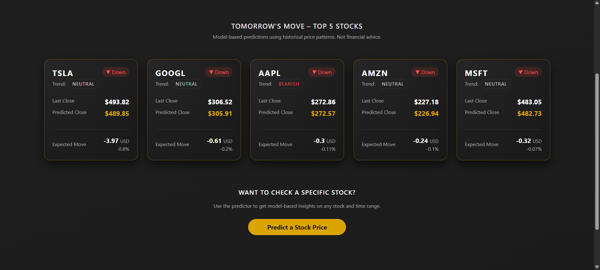
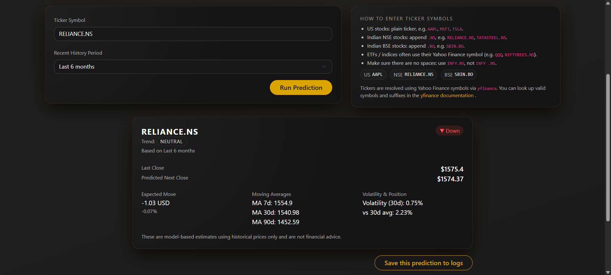
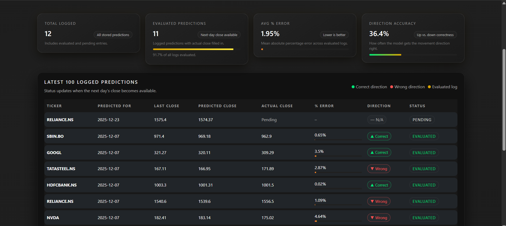

# 🚀 rcStocks — Stock Market Prediction Web App

[](https://rcstocks.onrender.com)

A Flask-powered web application that predicts next-day stock prices using supervised machine learning.
Built with a clean UI/UX, dark theme, IST time support, daily caching, and a fully-tracked accuracy log system.

---

## ⭐ Features

### 🔮 **Next-Day Stock Price Prediction**

* Uses historical OHLC data from *Yahoo Finance* (via `yfinance`)
* Automatically trains per-ticker Linear Regression models
* Stores trained models in `models/` for reuse
* Predictions include:

  * Last close price
  * Predicted next close
  * Expected move (abs + %)
  * Direction (Up / Down / Flat)
  * Short-term trend insights (MA7, MA30, MA90)

---

### 🏆 **Daily Top-5 Predictions (Homepage Dashboard)**

The home page shows:

* Top 5 selected tickers (AAPL, MSFT, AMZN, GOOGL, TSLA)
* Cached *once per day* (IST) in `json/top_stocks.json`
* Beautiful responsive card UI
* Instant loading without hitting APIs repeatedly

---

### 📅 **Prediction Logging System**

The app includes a full prediction tracking system:

#### ✔ Add predictions to log

After predicting a stock on `/predict`, users can add the result to the logs database.

#### ✔ Daily cross-check

When `/logs` is opened:

* Pending predictions (yesterday’s targets) are auto-evaluated
* Actual closing prices are fetched and compared
* Errors and accuracy metrics are computed
* Results are cached

#### ✔ Last 100 logs stored

Logged in `json/logs.json` with only the latest **100** entries retained.

#### ✔ Model statistics page

Shows a mini dashboard with:

* Average absolute error
* Average percent error
* Direction prediction accuracy
* Best and worst predictions
* Latest 100 logged entries

Aggregated stats are stored in `json/logs_data.json`.

---

### 🗂 Smart Model Cleanup

Old/unneeded `.pkl` models are deleted automatically:

* Keeps only:

  * Homepage tickers
  * Pending log tickers
* Everything else is cleaned automatically
* Ensures the `/models` folder stays small & tidy

---

### 🎨 **Clean UI / UX + Dark Theme**

* Fully responsive with Bootstrap 5
* Custom dark theme (`#181818`) with gold accent (`#dba400`)
* Soft gradients, glowing highlights, consistent cards
* Unified layout via `layout.html`
* IST live digital clock included on all pages

---

## 🛠 Tech Stack

**Backend**

* Flask (Python)
* Scikit-learn (Linear Regression)
* yfinance API
* JSON-based caching

**Frontend**

* Bootstrap 5
* HTML + Jinja2 templating
* Custom dark CSS theme
* Responsive dashboard cards

**Storage**

* `/models` → trained ML models (`.pkl`)
* `/json/top_stocks.json` → daily cached insights
* `/json/logs.json` → prediction logs
* `/json/logs_data.json` → computed accuracy statistics

---

## 📁 Project Structure

```
project/
│
├── app.py                    # Flask server + routes + caching + logs
├── modules/
│   └── stock_model.py        # Fetch, train, evaluate, predict, insights
│
├── templates/
│   ├── layout.html           # Global layout (navbar, footer, clock)
│   ├── index.html            # Homepage + Top 5 dashboard
│   ├── predict.html          # Stock prediction page
│   └── logs.html             # Model statistics + log viewer
│
├── models/                   # Auto-managed trained model .pkl files
│
└── json/
    ├── top_stocks.json       # Cached daily top 5 predictions
    ├── logs.json             # User prediction logs
    └── logs_data.json        # Aggregated accuracy metrics
```

---

## ⚙️ Installation & Setup

### 1. Clone repo

```bash
git clone https://github.com/RDC28/your-repo.git
cd your-repo
```

### 2. Create virtual environment

```bash
python -m venv venv
source venv/bin/activate      # Mac/Linux
venv\Scripts\activate         # Windows
```

### 3. Install dependencies

```bash
pip install -r requirements.txt
```

### 4. Run the app

```bash
python app.py
```

Open your browser:
👉 **[http://127.0.0.1:5000/](http://127.0.0.1:5000/)**

---

## 📸 Screenshots

### 🏠 Homepage


### 🔮 Predict Page


### 📊 Logs / Model Stats


---

## 📈 Model Details

### Algorithm

* **Linear Regression** (simple, fast, baseline model)

### Inputs

* Last 5 closing prices (lag-based supervised learning)

### Outputs

* Next-day predicted closing price
* Expected move + %
* Direction (Up/Down/Flat)

### Metrics (per log entry)

* Absolute error
* Percent error
* Direction correctness
* Moving averages & volatility-based signals

---

## ⚠ Disclaimer

This is an educational project.
Predictions are based solely on historical price patterns and **should not be used for real trading or financial decisions**.

---

## 📬 Contact

**Author:** @RDC28
**GitHub:** [https://github.com/RDC28](https://github.com/RDC28)
**Queries:** [rchavda2005@outlook.com](mailto:rchavda2005@outlook.com)